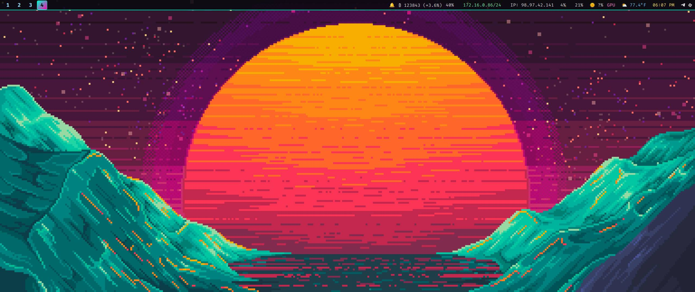

# Chris' NixOS Configuration with Hyprland

This is a flake-based NixOS configuration with Hyprland window manager support.

It's not really in a drop and go state, but if you're willing to tweak a few things
 (like replace my username) you sould be mostly set.

There are no doubt a few ways we could improve this for easier sharing. 


## Structure

```
.
├── flake.nix                    # Main flake configuration
├── hosts/
│   └── rvbee/
│       ├── system.nix           # Main system configuration
│       ├── hardware-configuration.nix  # Hardware-specific config
│       ├── hyprland.conf        # Hyprland window manager config
│       └── waybar.json          # Waybar status bar config
└── README.md                    # This file
```

### Full system overview




- **Hyprland/Wayland desktop**
  - Hyprland session via GDM (Wayland), `programs.hyprland.enable` with `xwayland.enable`
  - Autostarts `waybar`, `dunst`, `hyprpaper`, `hypridle`
  - Hyprland env/theme: `QT_QPA_PLATFORMTHEME=qt6ct`, Wayland-first (`NIXOS_OZONE_WL=1`, `MOZ_ENABLE_WAYLAND=1`, `QT_QPA_PLATFORM=wayland`, `GDK_BACKEND=wayland`)
  - Keybinds for DPMS, screenshots (grim/slurp), media/brightness, app launchers, workspace mgmt

- **Lock screen and idle**
  - `hyprlock` with PAM enabled (`security.pam.services.hyprlock = { };`)
  - `hypridle` drives DPMS/off-on and lock-before-sleep
  - Wallpaper templated into `hyprpaper` and `hyprlock` via activation script

- **Waybar + notifications**
  - Waybar modules for Hyprland workspaces/window, audio, network, CPU/Mem, brightness, AMD GPU, weather, BTC price, public IP, clock, tray
  - Dunst notifications; custom scripts installed into `~/.config/waybar/scripts/`

- **NixOS, flakes, channel**
  - Flake-based config on `nixos-unstable`
  - Inputs: `hyprwm/Hyprland` and `noblepayne/pretty-switch`
  - Formatter: `alejandra`
  - Declarative activation copies Hyprland/Waybar configs into `$HOME` each rebuild

- **Portals, audio, screenshare**
  - `xdg.portal.enable = true` with Hyprland preferred and GTK as extra
  - PipeWire + WirePlumber, ALSA/Pulse/JACK enabled (screenshare and pro-audio friendly)

- **Performance and reliability**
  - Zen kernel, ZRAM (`zstd`) enabled
  - BPF auto-tuning (`services.bpftune`) and BCC tools
  - Nix store auto-optimise; weekly GC
  - systemd OOM tuning for `nix-daemon`
  - Btrfs root with fstrim and autoscrub
  - CPU governor set to “performance”

- **Graphics**
  - Wayland + XWayland
  - RADV (Mesa) by default; 32-bit graphics enabled for gaming

- **Gaming**
  - Steam (Gamescope session, Remote Play and dedicated server firewall openings)
  - Lutris, `wineWowPackages.staging`, `winetricks`, `vulkan-tools`
  - `hardware.steam-hardware.enable = true` (controllers/udev rules)

- **Virtualization and containers**
  - libvirtd + virt-manager
  - Docker with weekly auto-prune

- **Files and desktop integration**
  - Dolphin with `kio-extras`, `kio-fuse`, `kio-admin`, thumbnailers, `ark`
  - `udisks2` for mounting; KDE polkit agent
  - Clipboard (`wl-clipboard`, `cliphist`), screen capture (grim/slurp), OSD, portals

- **Networking and security**
  - NetworkManager, Tailscale, OpenSSH, Netdata
  - Polkit enabled; sudo for wheel without password
  - Firewall currently disabled (intended choice)

- **Shell and tooling**
  - Fish shell + Atuin; rich dev/multimedia/system toolsets
  - Secrets kept out of the repo; systemd user service imports `GITHUB_TOKEN` from `~/.config/secrets/github_token` at login

## Notes:

1. You'll need to update the path with your home dir. 
   Search for chrislas, replace with your user.
	(Would like suggestions for improvement)

### Waybar & Hyprland UX changes

- **Waybar visuals**: Blur + slight transparency enabled (Hyprland `layerrule = blur, waybar` and `ignorealpha 0.1`; CSS background rgba(…, 0.75)).
- **Module chips**: Each module wrapped with padded, rounded boxes to reduce jitter when values change. Fixed minimum widths for key modules.
- **Left window title**: `hyprland/window` moved to the left next to workspaces.
- **Added modules**: MPRIS (media), idle inhibitor (icons: ☀️ active / 🌙 inactive), Gamemode indicator, reboot button (⏻ with rofi confirm), brightness menu icon (🖥️).

### Brightness control (rofi)

- **Keybind**: SUPER+B opens a rofi menu with common steps/presets.
- **Waybar**: monitor icon launches the same menu.
- **Script location**: installed to `~/.local/bin/rofi-brightness` (tilde path used in configs for portability).
- **Backends**: Uses `brightnessctl` for kernel backlight or `ddcutil` for external monitors. For DDC:
  - Ensure `hardware.i2c.enable = true;`
  - Add your user to the `i2c` group
  - Have `ddcutil` installed

### Network mounts (Thunar)

- Requires `services.gvfs.enable = true`, `services.gnome.gnome-keyring.enable = true`, and `glib-networking` package.
- Avahi mDNS discovery uses `services.avahi.nssmdns4 = true;` (renamed option).
- Optional: `services.davfs2.enable = true;` for WebDAV filesystem mounts (GVFS WebDAV also available).

### Theming

- GTK theme: Tokyo Night GTK; icons: Papirus; cursor: Bibata.
- Qt: `qt.platformTheme = "gnome"` with `qt.style = "adwaita-dark"` for consistency; `adwaita-qt{,6}` and `qt6ct` present.
- GTK4/libadwaita apps mostly follow dark mode + accent; GTK3/Thunar follow the full theme.

### Portability checklist

- `~/.local/bin/rofi-brightness` must be installed (activation script handles this) and `rofi` available.
- User should be in groups used by this setup: `wheel`, `networkmanager`, `i2c`, `docker`, etc.
- External monitor brightness: verify `ddcutil detect` sees your display; otherwise only kernel backlight works.
- Waybar CSS: GTK CSS is strict; avoid unsupported units/properties. This config uses conservative `em` widths and supported rules.
- Reboot button uses `rofi` for confirmation; adjust to your preferred prompt if you don’t use rofi.

